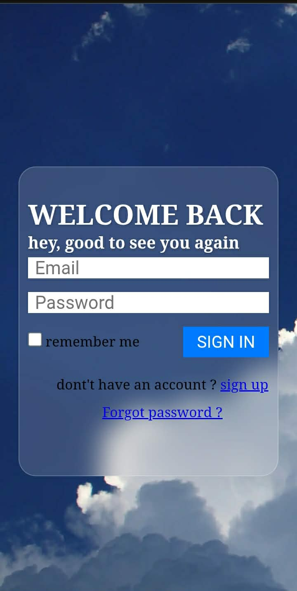

# Modern Authentication UI - Webook 🚀

A sleek and responsive Sign-Up and Login interface featuring a **Glassmorphism** design. This project was built to practice clean HTML/CSS structure and modern UI trends.

## ✨ Features
* **Glassmorphism UI:** Modern frosted-glass effect using `backdrop-filter`.
* **Fully Responsive:** Works perfectly on Desktop, Tablet, and Mobile devices.
* **Clean Code:** Organized CSS with a single stylesheet for multiple pages.
* **Optimized Performance:** Compressed assets for faster loading times.

## 🛠️ Technologies Used
* **HTML5:** Semantic structure.
* **CSS3:** Flexbox, Transitions, and Glassmorphism effects.
* **GitHub Pages:** For live hosting.
* ## 📱 Interface Preview

### Desktop View

### Mobile View

* 
## 🚀 Live Demo
[[Insert Your GitHub Pages Link Here](https://dibamel95-ux.github.io/Modern-Auth-System/)]

---
*Created with ❤️ by [Amel DIB]*
